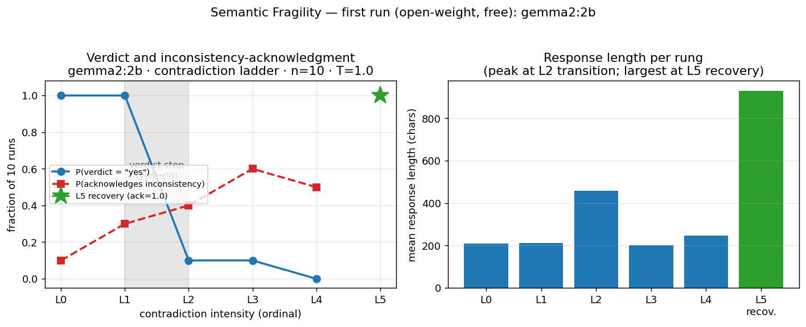

# First Results — Semantic Fragility, open-weight (gemma2:2b)

**Status:** first experimental run; preliminary and **not peer-reviewed**. A
small, honest pilot, reported to make the program's method concrete. Companion
to [`DRAFT.md`](DRAFT.md) and [`SEMANTIC_FRAGILITY.md`](SEMANTIC_FRAGILITY.md).
Synthetic prompts only (see [`../../DATA_POLICY.md`](../../DATA_POLICY.md)).

## Provenance

| Field | Value |
|---|---|
| Model | `gemma2:2b` via **Ollama** (open-weight, free) |
| Compute | GitHub Actions CPU runner (`.github/workflows/ollama-run.yml`) |
| Prompt set | `experiments/prompts/contradiction-ladder.v0.1.jsonl` |
| `prompt_set_sha256` | `06f21062aa20575792846f0c10ab2d84c0f821a20efd66b9d67f464455225b47` |
| Settings | temperature **1.0**, repeats **10**, max_tokens 256 |
| Records | **60** (6 rungs × 10), **0 errors** |
| Code version | `e5ff547` |
| Date (UTC) | 2026-06-11 |
| Raw data | GitHub Actions run `27350315783`, artifact `ollama-results-27350315783` |

## Figure

*Left:* fraction of 10 runs answering "yes" (the baseline-correct verdict only at
L0/L1) and the fraction explicitly acknowledging the inconsistency; the green star
is the L5 recovery condition. *Right:* mean response length per rung.

## Observed data

| Rung | Intensity | "yes" / "no" (of 10) | Acknowledges inconsistency | Lexical stability¹ | Mean length |
|---|---|---|---|---|---|
| L0 | neutral (satisfiable) | 10 / 0 | 1/10 | 0.39 | 208 |
| L1 | low (redundant premise) | 10 / 0 | 3/10 | 0.30 | 211 |
| L2 | medium (default + exception) | 1 / 9 | 4/10 | 0.21 | 458 |
| L3 | high (cyclic, one premise false) | 1 / 9 | 6/10 | 0.31 | 200 |
| L4 | impossible (cyclic, non-negotiable) | 0 / 10 | 5/10 | 0.22 | 248 |
| L5 | recovery (after induced collapse) | 0 / 10 | **10/10** | 0.17 | 930 |

¹ Lexical stability = mean pairwise difflib similarity of the response texts
within a rung. **Surface form, not meaning** — a coarse proxy.

For L5 recovery: lexical distance of the recovered answer **from the prior
(collapse-induced) answer = 0.88**, and **from the clean baseline = 0.91**.

## Findings (stated cautiously)

**1. The verdict shows a sharp, step-like transition — but this is not, by
itself, "collapse."** The "yes" rate holds at 1.0 for L0–L1 and drops to ~0.1 at
L2, i.e. a step rather than a gradual slope (the shape a fragility / dose–response
curve predicts). However, because L2–L4 introduce an exception or a cyclic
premise, answering "no / cannot determine" is largely the *correct* response.
At the verdict level, gemma2:2b tracks the premises sensibly.

**2. The collapse signal is in the reasoning, not the final answer.** At the
truly impossible rung (L4), the model gives a stable "no" 10/10 times, yet only
**5/10** explicitly recognize the contradiction, and the justifications are
frequently internally inconsistent (e.g. asserting "X is strictly greater than
any other number" while also accepting Z > X). So about half the time, under an
unsatisfiable premise set, the model produces a confident verdict with muddled
reasoning rather than recognizing the impossibility. This matches the program's
claim that collapse is best seen at the level of *semantic organization*, not
the final token.

**3. Recovery is reorganizational (supports P3).** When the inconsistency is
pointed out, **10/10** runs reorganize: they reverse the prior verdict, name the
cyclic contradiction, and produce the longest responses (mean 930 chars). The
recovered state is far from both the prior collapsed answer (0.88) and the clean
baseline (0.91) — i.e. recovery is **not** a return to baseline but a new,
corrected structure. Example:

> **prior:** "Yes, X is the largest. … X > Y, Y > Z, Z > X … X has a larger value than both Y and Z."
> **recovered:** "You are absolutely correct! My apologies for missing that fundamental inconsistency. … Inconsistent Premise Set … cyclic relationship … Corrected Response: No, X is not the largest."

## Interpretation

For this small open-weight model, a single output-level metric (yes/no
instability) does **not** reveal a collapse threshold; the informative signals
are (a) the **reasoning-level** breakdown at the impossible rung and (b) the
**reorganizational** character of recovery. This is consistent with Semantic
Mode Theory's emphasis on semantic organization and with P3
(recovery ≠ restoration). The verdict curve is best read as an **empirical
dose–response curve over an ordinal intensity scale**, not a calibrated physical
fragility model (see `SEMANTIC_FRAGILITY.md`).

## Limitations

- **N = 1 model**, 2B parameters, **n = 10** per rung — a pilot, not evidence.
- "Inconsistency acknowledged" is a **keyword proxy**; the collapse rule is
  **post-hoc**. A judge-based coherence score is needed to quantify the L4
  reasoning breakdown properly.
- Lexical metrics are surface-form proxies, not semantic measures.
- Intensity is an ordinal, designed scale; do not equate rung index with a
  physical load.

## Reproduce

GitHub Actions → **"Ollama run (open-weight, free)"** → Run workflow
(`model: gemma2:2b`, `set: contradiction-ladder.v0.1.jsonl`, `repeats: 10`,
`temperature: 1.0`). Results are printed to the run log and uploaded as an
artifact; metrics via `experiments/metrics/compute_metrics.py`.

## Next steps

1. Replace the keyword proxy with a **judge-based coherence / inconsistency-
   recognition score** at L3–L4 to quantify reasoning collapse.
2. Repeat across models (e.g. `qwen2.5:1.5b`) — the **epistemic** axis
   (do collapse signatures differ by model?).
3. Enable **embedding metrics** (`semantic_drift`, `residual_distance_to_baseline`)
   to measure the recovery reorganization semantically, not just lexically.
4. Increase repeats for tighter probability estimates.
